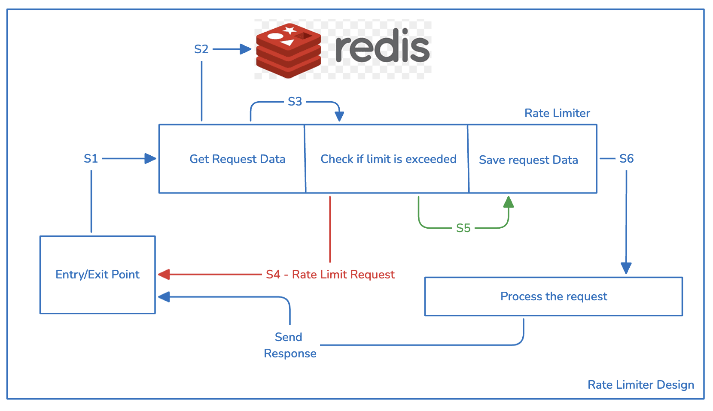
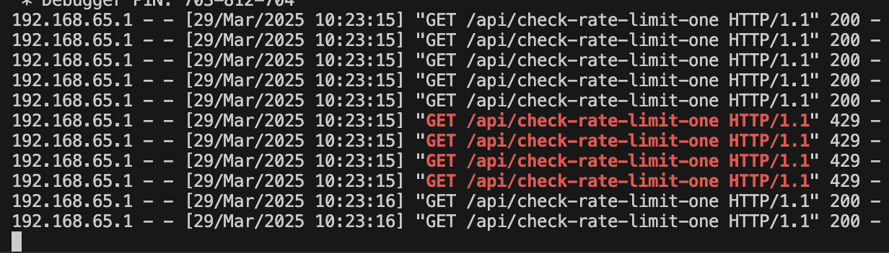

# Rate Limiting for Banking Transactions

Rate limiting refers to the process of putting a limit to the requests processed by a server from a specific address or a specific user. I have experienced it personally a lot of times, majorly while resetting social media passwords and giving wrong password multiple times and the rate limiter, most probably, caught me up and stopped processing requests for some time.

When it comes to banking applications, rate limiting is a must to stop spamming requests, while keeping the plafrorm up and healthy for genuine users.

While a lot of frameworks like Django, Flask etc provide prebuilt tools to implement rate limiting, I will be implementing a rate limiter from scratch.

## Thought Process and Approaches

1. API based backends, like REST are stateless, which means one a request response lifecycle is completed, the server doesn't have any information regarding the previous requests due to its stateless nature.  
2. So, to implement a rate limiter for incoming requests, they need to be stored somewhere, which is where we have <strong> two different approaches </strong> of designing one.   
  a. One approach is to store the data on the server itself. It may be stored in a global variable or in an on-premise file, but since on-premise file would require I/O processes, it'd be very non-optimal to use. So, storing the request in a global variable is a good option to choose for the first approach.  
  b. Second approach would be to use an external service like Redis. Redis, known for its speed and efficiency, often used for caching data, can be used to store the requests.   
  It is very important to choose a scalable approach for rate limiting as the rate limiter sits between the request being received and the same being processed, so it has to be very fast.   
3. Next thing would be to choose an efficient data structure. As already told, a rate limiter has to be very fast, so chosing a data structure to store the requests is very crucial as there would be continuous read-write operations to the data structure. So, it has to be efficient for both reads and writes. The best data structure for this would be a dictionary as the storage has to be like requests from a source and the number of requests, so the source could be the key and the count would be the corresponding value. So, if we go with first approach, we can use an in-memory dictionary and if we go with the Redis based approach, we can go with a Redis hash.

## Tradeoffs between the Approaches

Now coming to the tradeoffs between the in-memory variable approach and redis based approach, the Redis approach is a better choice. The in-memory approach has the following tradeoffs.

1. As soon as the server restarts, the in-memory variable data gets flushed off.
2. It is not a scalable approach. Imagine if our application gets millions of requests every second, the size of our dictionary would increase a lot, which in turn will shoot up the RAM.
3. If we have multiple nodes running and a load balancer setup, then the dictionaries will be exclusive to each node, so if a request exceeds limits on one node and the next request is routed to the other node, it will not be rate limited, which is a big issue.
4. Also, the dictionary needs to be cleaned up. For example if User A makes two requests and we store it like {"user_a": 2}. If the user went away for a couple of hours, the entry from the dictionary needs to be cleaned up, right? So, for that we need to write a mechanism as Python doesn't support this natively.

### Redis Tradeoffs 

1. The Redis approach too comes with some tradeoffs like network latency and initial redis setup, but if we dockerize the Redis and backend containers and keep them on the same network, the latency will be reduced. 

<strong> For building the rate limiter, I'll be choosing a Redis based appproach with Flask. The application and the Redis both will be dockerized and kept on the same network.

Here is the screenshot demonstrating the rate limit.

If we analyse the logs, the first request came at 10:23:15, which was passed, followed by 8 subsequent requests at the same second, out of which only four were passed and the remaining three were rate limited as the logic I have written is to allow only five requests per second. I have implemented IP based rate limting as the authentication system isn't setup. If the auth system is setup, the redis key can be constructed using the user ID instead of IP address.